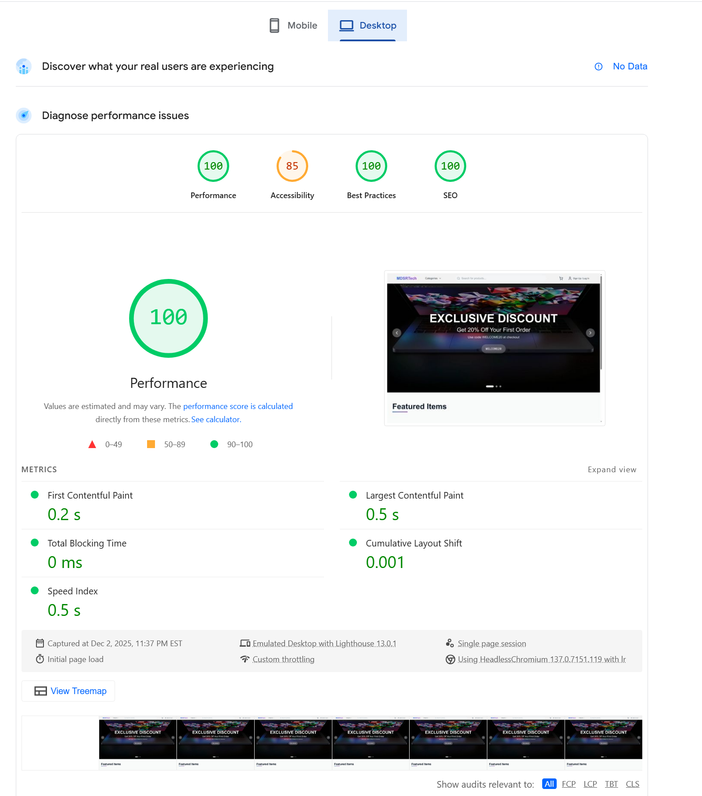
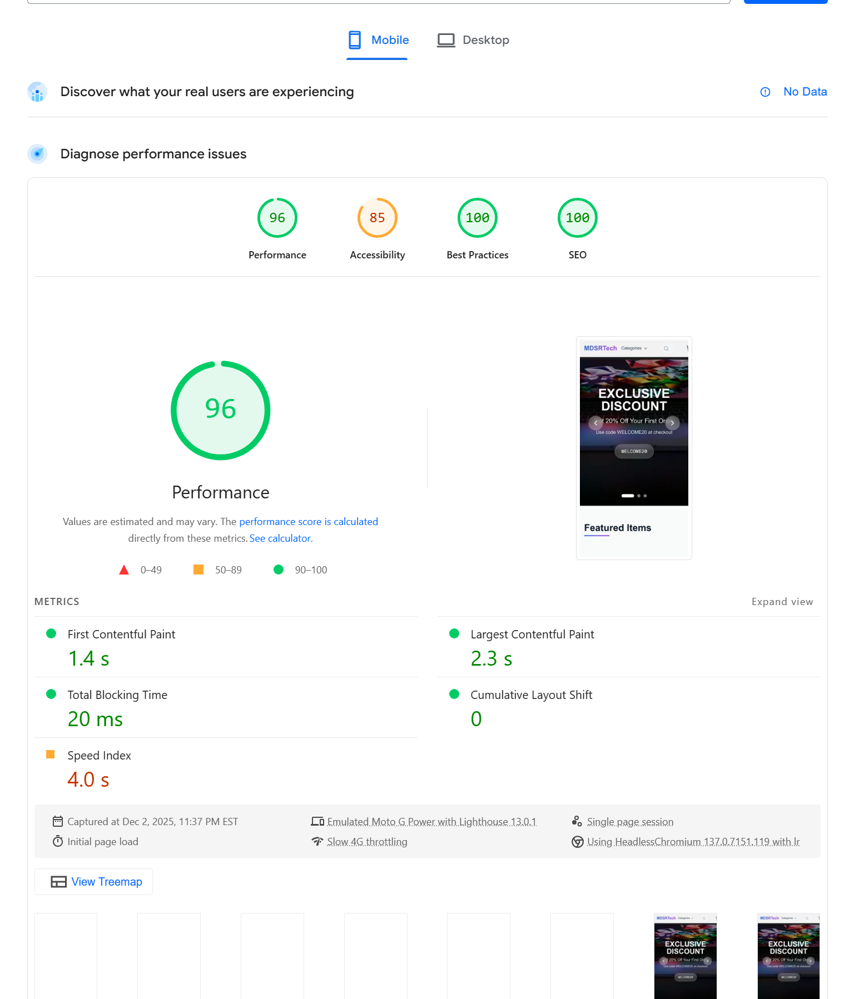

# MDSRTech E-Commerce Platform

A full-stack e-commerce application built with **Next.js 15** (frontend) and **Flask** (backend), featuring user authentication, product catalog, shopping cart, wishlist, Stripe payments, and order management.

> **📝 Note for Instructor:** The environment variables required for Docker setup will be provided separately via Canvas message. Please create a `backend/.env` file with those values before running Docker.

---

## Youtube Demo

Link: **********

---

## 🌐 Deployed Site

- **Frontend**: [https://mdsrtech.vercel.app](https://mdsrtech.vercel.app)
- **Backend API**: [https://e-commerce-project-production-dd50.up.railway.app](https://e-commerce-project-production-dd50.up.railway.app)

---

## 📚 Documentation

| Document | Description |
|----------|-------------|
| [README.md](README.md) | Project overview and setup instructions
| [docs/API.md](docs/API.md) | Complete API endpoint documentation |
| [docs/DEPLOYMENT.md](docs/DEPLOYMENT.md) | Deployment process and CI/CD pipeline |
| [docs/architecture.md](docs/architecture.md) | System architecture and UML diagrams |

---

## 🚀 Quick Start with Docker

### Prerequisites

- [Docker](https://www.docker.com/get-started) installed
- [Docker Compose](https://docs.docker.com/compose/install/) installed

### Steps

1. **Clone the repository**
   ```bash
   git clone https://github.com/MDSR-Tech/E-commerce_project.git
   cd E-commerce_project
   ```

2. **Create environment file**
   
   Create `backend/.env` with the following variables (values provided separately via Canvas):
   ```env
   # Flask
   FLASK_APP=app.py
   FLASK_ENV=development
   DEBUG=True

   # Database (Supabase PostgreSQL)
   DATABASE_URL=postgresql://...

   # JWT
   JWT_SECRET_KEY=...

   # CORS & Frontend
   CORS_ORIGINS=http://localhost:3000
   FRONTEND_URL=http://localhost:3000

   # Email (Gmail SMTP)
   MAIL_SERVER=smtp.gmail.com
   MAIL_PORT=587
   MAIL_USE_TLS=True
   MAIL_USE_SSL=False
   MAIL_USERNAME=...
   MAIL_PASSWORD=...
   MAIL_DEFAULT_SENDER=...

   # Google OAuth
   GOOGLE_CLIENT_ID=...
   GOOGLE_CLIENT_SECRET=...
   GOOGLE_REDIRECT_URI=http://localhost:5000/api/auth/google/callback

   # GitHub OAuth
   GITHUB_CLIENT_ID=...
   GITHUB_CLIENT_SECRET=...
   GITHUB_REDIRECT_URI=http://localhost:5000/api/auth/github/callback

   # Stripe
   STRIPE_SECRET_KEY=sk_test_...
   STRIPE_PUBLISHABLE_KEY=pk_test_...
   STRIPE_WEBHOOK_SECRET=
   ```

3. **Build and run with Docker Compose**
   ```bash
   docker-compose up --build
   ```
   
   > **Note:** The first build may take **3-10 minutes** as it downloads base images and installs dependencies. Subsequent builds are faster due to Docker caching.

4. **Access the application**
   - Frontend: [http://localhost:3000](http://localhost:3000)
   - Backend API: [http://localhost:5000/api](http://localhost:5000/api)

5. **Stop the application**
   ```bash
   docker-compose down
   ```

### Docker Architecture

```
docker-compose.yml
├── backend (Flask)
│   ├── Port: 5000
│   ├── Dockerfile.dev
│   └── Volume: ./backend:/app
│
├── frontend (Next.js)
│   ├── Port: 3000
│   ├── Dockerfile.dev
│   └── Volume: ./frontend/mdsrtech:/app
│
└── Network: ecommerce-network (internal communication)
```

The frontend connects to the backend using Docker's internal networking (`http://backend:5000/api`) for server-side rendering, while browser requests use `http://localhost:5000/api`.

---

## 🛠️ Manual Setup (Without Docker)

### Backend (Flask)

1. **Navigate to backend directory**
   ```bash
   cd backend
   ```

2. **Create virtual environment**
   ```bash
   python -m venv venv
   source venv/bin/activate  # On Windows: venv\Scripts\activate
   ```

3. **Install dependencies**
   ```bash
   pip install -r requirements.txt
   ```

4. **Set environment variables**
   
   Create `backend/.env` with required variables (see [Environment Variables](#environment-variables)).

5. **Run the development server**
   ```bash
   flask run
   ```
   Backend runs at [http://localhost:5000](http://localhost:5000)

### Frontend (Next.js)

1. **Navigate to frontend directory**
   ```bash
   cd frontend/mdsrtech
   ```

2. **Install dependencies**
   ```bash
   npm install
   ```

3. **Set environment variables**
   
   Create a `.env.local` file:
   ```env
   NEXT_PUBLIC_API_URL=http://localhost:5000/api
   ```

4. **Run the development server**
   ```bash
   npm run dev
   ```
   Frontend runs at [http://localhost:3000](http://localhost:3000)

---

## 🔧 Environment Variables

### Required Variables

| Variable | Description |
|----------|-------------|
| `DATABASE_URL` | PostgreSQL connection string (Supabase) |
| `JWT_SECRET_KEY` | Secret key for JWT tokens |
| `CORS_ORIGINS` | Allowed CORS origins (e.g., `http://localhost:3000`) |
| `FRONTEND_URL` | Frontend URL for OAuth redirects |
| `STRIPE_SECRET_KEY` | Stripe secret key for payments |
| `STRIPE_PUBLISHABLE_KEY` | Stripe publishable key |

### Optional Variables

| Variable | Description |
|----------|-------------|
| `GOOGLE_CLIENT_ID` | Google OAuth client ID |
| `GOOGLE_CLIENT_SECRET` | Google OAuth client secret |
| `GOOGLE_REDIRECT_URI` | Google OAuth callback URL |
| `GITHUB_CLIENT_ID` | GitHub OAuth client ID |
| `GITHUB_CLIENT_SECRET` | GitHub OAuth client secret |
| `GITHUB_REDIRECT_URI` | GitHub OAuth callback URL |
| `MAIL_SERVER` | SMTP server (default: `smtp.gmail.com`) |
| `MAIL_PORT` | SMTP port (default: `587`) |
| `MAIL_USE_TLS` | Use TLS (default: `True`) |
| `MAIL_USERNAME` | Gmail address for sending emails |
| `MAIL_PASSWORD` | Gmail app password |
| `MAIL_DEFAULT_SENDER` | Default sender email address |

---

## ✨ Features

### User Authentication
- Email/password registration and login
- OAuth 2.0 (Google and GitHub)
- JWT-based authentication with refresh tokens
- Password reset via email

### Product Catalog
- Browse products by category
- Search functionality with filters
- Product details with multiple images
- Sale prices and discounts

### Shopping Cart
- Add/remove items
- Update quantities
- Promo code support
- Persistent cart (survives page refresh)

### Wishlist
- Save products for later
- Toggle add/remove
- View wishlist items

### Checkout & Payments
- Secure Stripe Checkout integration
- Shipping address collection
- Order confirmation emails

### Order Management
- View order history
- Order details and tracking
- Cancel pending orders

---

## 🏗️ Architecture

### Technology Stack

| Layer | Technology |
|-------|------------|
| Frontend | Next.js 15, React 19, TypeScript, TailwindCSS |
| Backend | Flask 3.0, Flask-SQLAlchemy, Flask-JWT-Extended |
| Database | PostgreSQL (Supabase) |
| Authentication | JWT, OAuth 2.0 (Google, GitHub) |
| Payments | Stripe Checkout |
| Deployment | Vercel (Frontend), Railway (Backend) |
| Containerization | Docker, Docker Compose |

### System Architecture

See [docs/architecture.md](docs/architecture.md) for detailed UML diagrams including:
- **Package Diagram** - System components and dependencies
- **Class Diagram** - Database models and relationships

---

## 📁 Project Structure

```
E-commerce_project/
├── backend/                    # Flask API
│   ├── app.py                 # Application factory
│   ├── auth.py                # Authentication routes
│   ├── products.py            # Product routes
│   ├── cart.py                # Cart routes
│   ├── orders.py              # Order routes
│   ├── checkout.py            # Stripe checkout
│   ├── wishlist.py            # Wishlist routes
│   ├── models.py              # SQLAlchemy models
│   ├── extensions.py          # Flask extensions
│   ├── requirements.txt       # Python dependencies
│   ├── Dockerfile             # Production Docker image
│   ├── Dockerfile.dev         # Development Docker image
│   └── tests/                 # Test suite
│       ├── conftest.py        # Test fixtures
│       ├── test_unit.py       # Unit tests (18 tests)
│       ├── test_integration.py # Integration tests (35 tests)
│       └── test_e2e_selenium.py # E2E tests (20 tests)
│
├── frontend/mdsrtech/          # Next.js Frontend
│   ├── app/                   # App router pages
│   │   ├── page.tsx           # Home page
│   │   ├── auth/              # Authentication pages
│   │   ├── cart/              # Shopping cart
│   │   ├── wishlist/          # Wishlist page
│   │   ├── orders/            # Order history
│   │   ├── checkout/          # Checkout flow
│   │   ├── product/           # Product details
│   │   ├── category/          # Category pages
│   │   ├── search/            # Search results
│   │   └── components/        # Reusable components
│   ├── contexts/              # React contexts
│   ├── lib/                   # Utilities and API clients
│   ├── package.json           # Node dependencies
│   └── Dockerfile.dev         # Development Docker image
│
├── docs/                       # Documentation
│   ├── API.md                 # API endpoint documentation
│   ├── DEPLOYMENT.md          # Deployment guide
│   └── architecture.md        # Architecture & UML diagrams
│
├── .github/workflows/         # CI/CD pipelines
│   └── ci.yml                 # GitHub Actions workflow
│
├── docker-compose.yml         # Docker Compose configuration
└── README.md                  
```

---

## 🔌 API Endpoints

Full API documentation is available in [docs/API.md](docs/API.md).

### Quick Reference

| Endpoint | Method | Description | Auth |
|----------|--------|-------------|------|
| `/api/auth/register` | POST | Register new user | No |
| `/api/auth/login` | POST | Login with email/password | No |
| `/api/auth/refresh` | POST | Refresh JWT token | Yes |
| `/api/auth/me` | GET | Get current user | Yes |
| `/api/auth/google` | GET | Google OAuth | No |
| `/api/auth/github` | GET | GitHub OAuth | No |
| `/api/auth/forgot-password` | POST | Request password reset | No |
| `/api/auth/reset-password` | POST | Reset password | No |
| `/api/products` | GET | List all products | No |
| `/api/products/{id}` | GET | Get product by ID | No |
| `/api/products/slug/{slug}` | GET | Get product by slug | No |
| `/api/search?q=` | GET | Search products | No |
| `/api/categories` | GET | List categories | No |
| `/api/brands` | GET | List brands | No |
| `/api/cart` | GET | Get user's cart | Yes |
| `/api/cart/add` | POST | Add to cart | Yes |
| `/api/cart/update` | PUT | Update cart item | Yes |
| `/api/cart/remove` | DELETE | Remove from cart | Yes |
| `/api/cart/clear` | DELETE | Clear cart | Yes |
| `/api/wishlist` | GET | Get wishlist | Yes |
| `/api/wishlist/toggle` | POST | Toggle wishlist item | Yes |
| `/api/orders` | GET | Get user's orders | Yes |
| `/api/orders/{id}` | GET | Get order details | Yes |
| `/api/checkout/create-session` | POST | Create Stripe session | Yes |

---

## 🧪 Testing

The project includes comprehensive testing at three levels.

### Test Structure

```
backend/tests/
├── conftest.py           # Pytest fixtures and configuration
├── test_unit.py          # Unit tests for core functionality (18 tests)
├── test_integration.py   # API endpoint integration tests (35 tests)
└── test_e2e_selenium.py  # Browser-based end-to-end tests (20 tests)
```

### Running Tests

```bash
cd backend

# Install test dependencies
pip install pytest pytest-cov selenium webdriver-manager

# Run all tests
pytest

# Run unit tests only
pytest tests/test_unit.py -v

# Run integration tests only
pytest tests/test_integration.py -v

# Run E2E tests (requires frontend/backend running)
pytest tests/test_e2e_selenium.py -v

# Run with coverage report
pytest --cov=. --cov-report=html
```

### Test Coverage

| Test Type | Tests | Description |
|-----------|-------|-------------|
| **Unit** | 18 | Model properties, calculations, validation, password hashing |
| **Integration** | 35 | API endpoints, authentication, error handling |
| **E2E (Selenium)** | 20 | Browser flows, responsive design, accessibility |
| **Total** | 73 | (61 passing, 12 skipped for SQLite/PostgreSQL compatibility) |

### Unit Test Coverage
- Product model properties (`is_on_sale`, `sale_price_cents`)
- Price calculations (subtotal, tax, totals)
- Password hashing and verification
- User model defaults and validation

### Integration Test Coverage
- Authentication API (register, login, refresh, admin)
- Products API (list, get by ID/slug, search)
- Cart API (add, update, remove, count)
- Wishlist API (toggle, list, IDs)
- Orders API (list, get details)
- Error handling (401, 403, 404, 405)

### E2E Test Coverage
- Home page and navigation
- User registration and login flows
- Product browsing and search
- Cart functionality
- Responsive design (mobile/tablet)
- Basic accessibility checks

---

## 🚀 Performance

### PageSpeed Insights

Performance analysis of the deployed application using [Google PageSpeed Insights](https://pagespeed.web.dev/).

#### Desktop Performance



#### Mobile Performance



### Performance Optimizations

1. **Frontend (Next.js)**
   - Automatic code splitting
   - Image optimization with `next/image`
   - Static generation where possible
   - Edge caching via Vercel CDN

2. **Backend (Flask)**
   - Database query optimization
   - Connection pooling via Supabase
   - Response caching headers
   - Gunicorn multi-worker setup

---

## 📦 Deployment

Full deployment documentation is available in [docs/DEPLOYMENT.md](docs/DEPLOYMENT.md).

### Deployment Overview

| Component | Platform | URL | Auto-Deploy |
|-----------|----------|-----|-------------|
| Frontend | Vercel | [mdsrtech.vercel.app](https://mdsrtech.vercel.app) | ✅ On push to main |
| Backend | Railway | [railway.app](https://e-commerce-project-production-dd50.up.railway.app) | ✅ On push to main |
| Database | Supabase | Hosted PostgreSQL | N/A (managed) |

### CI/CD Pipeline

GitHub Actions runs on every push:
1. **Lint** - Python (flake8) and TypeScript (ESLint)
2. **Test** - Run pytest test suite
3. **Build** - Build Next.js frontend
4. **Deploy** - Auto-deploy to Vercel and Railway

---