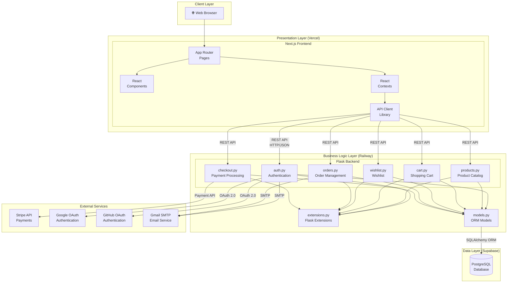
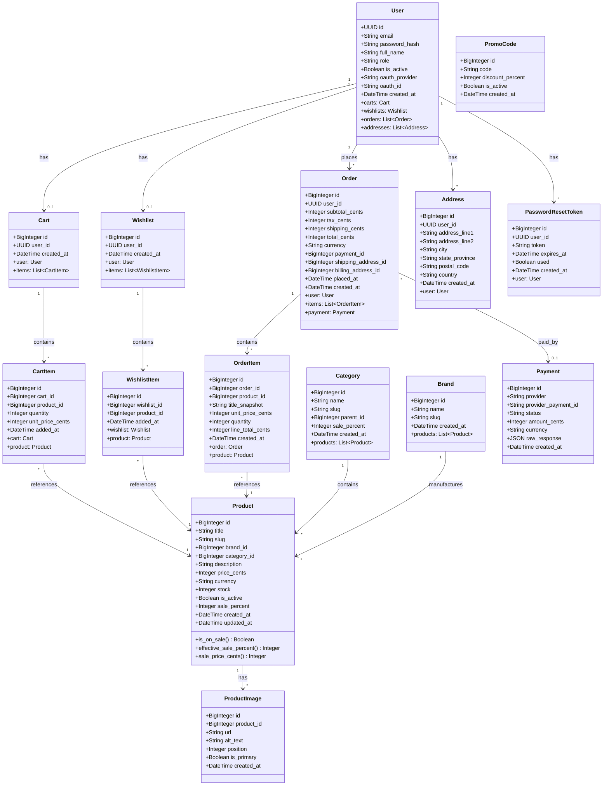

# MDSRTech Architecture Documentation

## System Overview

MDSRTech is a full-stack e-commerce platform built with a **layered architecture** that separates concerns between the presentation layer (Next.js frontend), business logic layer (Flask API), and data layer (PostgreSQL database).

---

## UML Package Diagram

The package diagram shows the high-level structure and dependencies between major components.

---

## UML Class Diagram

The class diagram shows the database models and their relationships.

---

## Technology Stack Summary

| Layer | Technology | Purpose |
|-------|------------|---------|
| **Frontend** | Next.js 15, React 19, TypeScript | Server-side rendering, UI components |
| **Styling** | TailwindCSS, Lucide Icons | Responsive design, iconography |
| **State Management** | React Context API | Auth, Cart, Wishlist state |
| **Backend** | Flask 3.0, Python 3.11 | REST API, business logic |
| **ORM** | SQLAlchemy | Database abstraction |
| **Authentication** | Flask-JWT-Extended, OAuth 2.0 | Token-based auth, social login |
| **Database** | PostgreSQL (Supabase) | Data persistence |
| **Payments** | Stripe Checkout | Secure payment processing |
| **Deployment** | Vercel, Railway, Docker | Cloud hosting, containerization |
